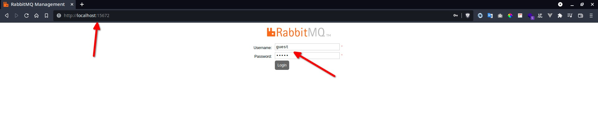
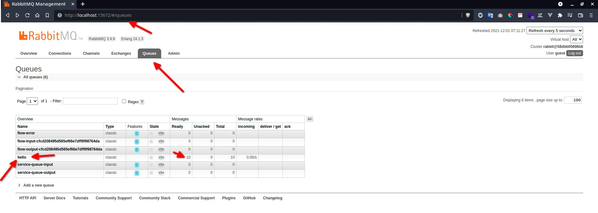
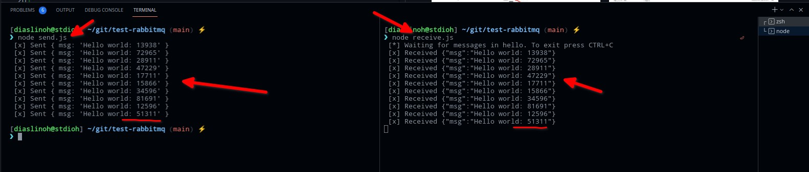

# test-rabbitmq
Testing RabbitMQ

# Requirements
1. [Docker](https://www.docker.com/get-started)
2. [Node/Npm >= 14.18.1](https://nodejs.org/pt-br/download/)   

 # Setup 💻💻💻
 ```sh
git clone https://github.com/stdioh321/test-rabbitmq.git
cd test-rabbitmq
npm install
docker run -p 15672:15672 -p 5672:5672 rabbitmq:3-management  
 ```

 Access on your browser:
 
 <span style="font-size:1.4em">http://localhost:15672</span>

 > user/pass = guest

And go to the page queues.
|Login|Queues|
|:----|:----|
||

In this example we will be using the queue "**hello**"
 # Run 🏃🏃🏃
 ```sh
 # In one terminal
 node send.js

 # In another terminal
 node receive.js
 ```
|Send/Receive|
|:-----------|
||

 # References 📖📖📖
 * https://www.rabbitmq.com/tutorials/tutorial-one-javascript.html